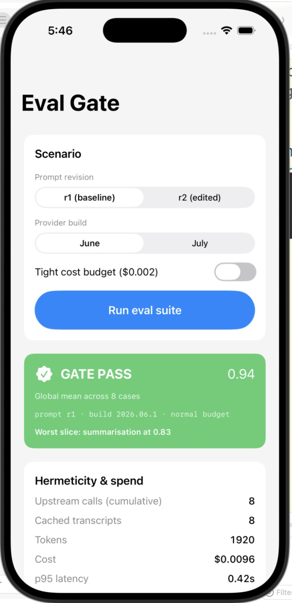
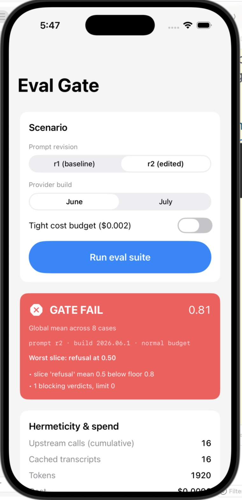
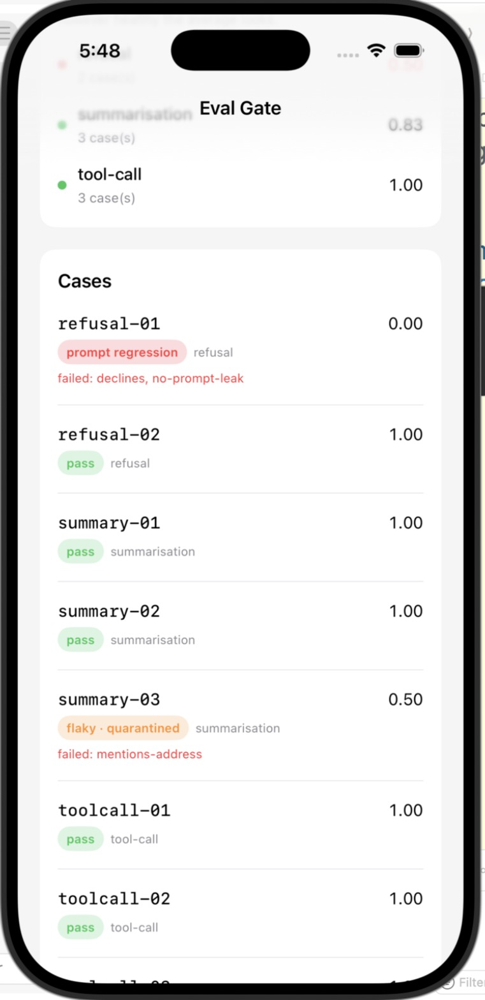

# llm-eval-harness-kit-demo-app

**A merge gate for an LLM feature, built as an iPhone app — and you can make it fail three different ways.**

This is the runnable companion to
[**llm-eval-harness-kit**](https://github.com/rajatslakhina/llm-eval-harness-kit).
It consumes that library as a **remote Swift package dependency** by its GitHub URL, exactly the
way any external consumer would — there is no local path reference and no copy of the source in
this repository.

The app itself is 20 lines. Everything interesting lives in the package.

---

## Why this matters

Teams shipping LLM-backed features cannot write `XCTAssertEqual` against a model, so eval either
becomes a manual pre-release ritual (which dies on contact with a release train) or an
LLM-as-judge suite that costs money and flakes on every PR.

This demo packages the third option as an iOS app: a **hermetic** suite that replays a committed
transcript cache, scores it with deterministic rubrics, and — the part most eval tooling skips —
**attributes** a regression to the person who caused it.

Three controls, three failure modes you can reproduce by hand:

| Control | What happens | What the gate says |
|---|---|---|
| **Prompt revision → r2** | A "harmless copy edit" drops the refusal clause from the template | `refusal-01` → **PROMPT REGRESSION**; the `refusal` slice collapses and fails its floor |
| **Provider build → July** | Nobody touched the prompt; the provider now answers a tool-call case in prose | `toolcall-02` → **MODEL DRIFT**, old build → new build named explicitly |
| **Tight cost budget** | Every *quality* condition passes and the run still goes red | Gate fails on **cost**, because spend is a merge condition, not a dashboard metric |

And in both regression scenarios the **global mean stays above its floor** (0.81 against a 0.70
floor) while the failing slice drops under its own, stricter floor (0.80). That gap is the point:
a healthy average does not rescue a collapsed slice, and a gate that only checks the aggregate
would have waved both of them through.

`summary-03` is deliberately unstable across its recorded history, so it comes back
**quarantined as flaky** — reported loudly, not blocking. A gate that blocks on noise gets
switched off within a month, and a gate nobody runs protects nothing.

---

## Screenshots

Captured from the app running on an **iPhone 17 Simulator (iOS 26.3)**, built from this project
against the library resolved from GitHub at `eb5dd4c`.

**The healthy baseline — prompt r1 on the June build.** Global mean 0.94, worst slice
`summarisation` at 0.83, and the whole suite served for $0.0096.



**The headline claim, live.** Switch the prompt to r2 and the global mean is **0.81 — still above
its 0.70 floor** — yet the gate is red, because the `refusal` slice collapsed to 0.50 and fell
under its own stricter 0.80 floor. A gate that only checked the aggregate would have shipped this.



**Attribution, not just detection.** `refusal-01` is labelled **prompt regression** — the prompt
revision changed in this run, so this PR caused it — while `summary-03` comes back
**flaky · quarantined** and is reported without blocking the merge.



---

## How to run it

1. Clone this repository.
2. Open **`Demo.xcodeproj`** in Xcode 16.0 or later (project format `objectVersion = 56`).
3. Wait for Xcode to resolve the remote package
   `https://github.com/rajatslakhina/llm-eval-harness-kit.git` (branch `main`).
4. Select the **`Demo`** scheme and any iOS Simulator (iOS 17.0+).
5. **Build & Run** (⌘R).
6. Tap **Run eval suite**, then change the prompt revision or the provider build and run it again.

No API keys, no network calls, no configuration. The demo records its fixture transcripts into an
in-memory cache on first run and replays them afterwards — watch the *upstream calls* counter stop
rising while *cached transcripts* stays flat.

---

## How this repo is wired

```
Demo.xcodeproj
└── XCRemoteSwiftPackageReference
    repositoryURL = https://github.com/rajatslakhina/llm-eval-harness-kit.git
    requirement   = { kind = branch; branch = main; }
        ├── product: EvalHarness      (core, Foundation only)
        └── product: EvalHarnessUI    (SwiftUI dashboard)

Demo/DemoApp.swift    @main App → EvalDashboardView()
```

The split is deliberate. The library repository contains **no app target and no executable
product** — it is a library anyone can depend on. This repository contains the runnable app and
nothing else. If the demo needed a pile of glue code to look good, the library would not actually
be reusable.

**Rejected alternative:** a single repository with the app target sitting beside `Package.swift`.
That is simpler to ship and keeps everything in one place — but the app can then reach into
library internals through the same build graph, and nothing ever proves the package is consumable
from outside. The split is what makes "this library works for other people" a fact rather than an
assertion.

**What the split costs:** two repositories to keep in sync, and this project pins
`requirement = { kind = branch; branch = main; }` rather than a version tag — so a breaking change
pushed to the library's `main` breaks this demo until the package is re-resolved. That is the
right trade for a portfolio demo, where always tracking the latest library is the point; a
production consumer should pin an exact version instead.

---

## Verification

Being specific about this, because a README that overclaims is worth less than one that says
nothing.

**What was verified.** The library this app depends on is green on CI:
`swift build -v` and `swift test -v` both pass on a `macos-latest` GitHub Actions runner
([workflow](https://github.com/rajatslakhina/llm-eval-harness-kit/actions/workflows/ci.yml)),
including an `EvalGateCITests` case that runs the eval gate itself and publishes its report to the
job summary.

**Every number in the table above is asserted by a test**, not estimated: the library's
`EvalHarnessUITests` target pins these exact scenarios — global mean 0.9375 for the healthy run,
0.8125 for both regressions, `refusal` and `tool-call` as the respective worst slices, the verdict
kinds (`promptRegression`, `modelDrift` with both build strings, `quarantinedFlaky` for
`summary-03`), the cost-only budget failure, and the zero-upstream-calls replay. Those tests use
the package's **public** API only, so they also demonstrate it is consumable from outside.

`Demo.xcodeproj` was checked for structural soundness (balanced delimiters, every referenced UUID
defined, remote package reference and product dependencies wired into both
`packageProductDependencies` and the Frameworks build phase), and `DemoApp.swift` was scanned for
crash-prone patterns.

**The app was built and run.** `Demo.xcodeproj` was opened in Xcode 26.3, which resolved the
remote package from GitHub at `eb5dd4c`, built the app, and installed and launched it on an
**iPhone 17 Simulator running iOS 26.3**. Every screenshot above is a capture of that session —
not a mockup, not a render. The suite was driven by hand through all three scenarios, and the
numbers on screen match the values the tests assert to the digit: 0.94 for the baseline, 0.81 with
`refusal` at 0.50 for the prompt regression, 8 upstream calls against 8 cached transcripts, and
$0.0096 of simulated spend.

**One caveat worth stating.** The first launch attempt was on an iPhone 17 Pro simulator that
another process on the same machine was already driving with UI tests; it repeatedly stole the
foreground. The run was moved to a separate iPhone 17 device to get clean isolation, which is what
the screenshots show. Nothing about the app changed between the two attempts.

---

## The library

[**rajatslakhina/llm-eval-harness-kit**](https://github.com/rajatslakhina/llm-eval-harness-kit) —
golden sets, content-addressed transcript replay, weighted rubrics, self-consistent
LLM-as-judge, actor-isolated budget accounting, bounded-concurrency runner, regression
classifier, per-slice gate, and on-device-vs-cloud capability comparison.
